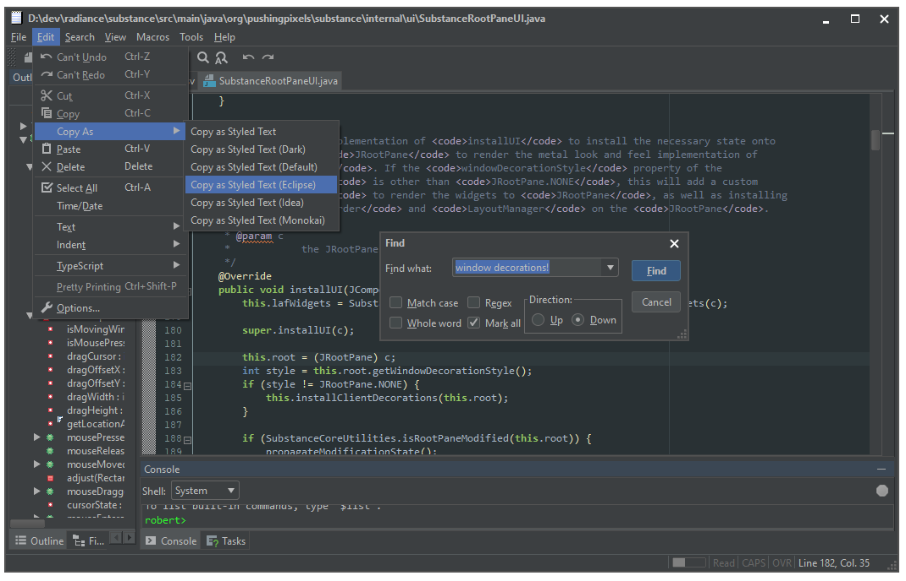

Darcula IDE Theme
=================

Darcula Look and Feel

This is a fork of bulenkov's original Darcula that currently adds the following features, mostly
tweaks to match newer versions of IntelliJ IDEA.  It's just several small things that adds up to
a lot of polish:

* JToolBars have rollover enabled (thus toolbar buttons appear flat)
* JButtons in tool bars look like those in IntelliJ 2016 when armed/rollover
* JButtons have flat appearance found in IntelliJ 2018+
* Application font matches desktop's default (on Windows)
* Minor margins around menu items in menus
* Bezel effect on disabled JButtons' text is removed
* JMenuBar dims when the application loses focus
* Slightly larger, flatter look for JTableHeaders (doesn't match IDEA, just personal preference here)
* Single-line bottom border for JMenuBar
* Built with Java 7 instead of Java 8
* `JFrame/JDialog.setDfeaultLookAndFeelDecoreated(true)` actually work and look decent (screenshot below)

Coming soon:

* Text component background darkens slightly when focused
* Application font matches desktop's default (on OS X and Linux)
* Nicer-looking split pane

